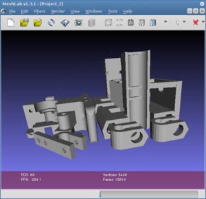

Při návrhu a tisku objektů využíváme několik aplikací. Tady najdete jejich seznam.

### OpenSCAD
 Pro 3D modelovaní existuje nespočet programů. Ve většině z nich ale uživatel modeluje v režimu WYSIWYG, tedy myší manipuluje s objekty přímo v projekci. V OpenSCADu ale modely programujete: vytváříte základní tvary a ty k sobě např. přičítáte nebo od sebe odečítáte. Říká se tomu [CSG modeling](http://en.wikipedia.org/wiki/Constructive_solid_geometry). Pokud budete vyrábět film nebo hru, asi budete chtít pracovat spíše s vizuální stránkou věci; oproti tomu, pokud budete modelovat součástku do stroje, bude vás spíš zajímat absolutní kontrola nad tvarem objektu. V tom případě by vás mohl OpenSCAD zaujmout. My jej používáme například k návrhům součástek na nové tiskárny.

Výuka programování součástek v OpenSCADu je součástí [předmětu 3D tisk na FIT ČVUT](vyuka).

{{ site.icons.web }} [Český článek na LinuxEXPRES.cz](http://www.linuxexpres.cz/software/openscad-programujte-3d-modely-wysiwym)

{{ site.icons.web }} [Domovská stránka OpenSCADu](http://www.openscad.org/)
{{ site.icons.web }} [Rozsáhlý manuál](http://en.wikibooks.org/wiki/OpenSCAD_User_Manual)

{{ site.icons.fedora }} `sudo yum install openscad openscad-MCAD`
{{ site.icons.ubuntu }} `sudo apt-get install openscad`

### MeshLab
 MeshLab je aplikace pro vytváření a editaci 3D modelů. MeshLab vznikl na Fakultě informatiky Univerzity v Pise, vytvořili jej z převážné části sami studenti. Umožňuje importovat a exportovat různé formáty pro reprezentaci 3D dat. Kromě hlavní části aplikace umožňuje především jednoduše prohlížet 3D objekty ve formátu STL a zjednodušovat je.

{{ site.icons.web }} [Domovská stránka MeshLabu](http://meshlab.sourceforge.net/)

{{ site.icons.web }} [MeshLab Blog](http://meshlabstuff.blogspot.com/)

{{ site.icons.web }} [MeshLabu Wiki](https://sourceforge.net/apps/mediawiki/meshlab)

{{ site.icons.fedora }} `sudo yum install meshlab`
{{ site.icons.ubuntu }} `sudo apt-get install meshlab`

### Skeinforge a SFACT
Skeinforge slouží ke slicování objektů, tedy k nařezání na jednotlivé tiskové vrstvy a k vypočítání průběhu tiskové hlavy. Přestože jeho uživatelské rozhraní není zrovna přívětivé a slicování trvá velice dlouho, dosahuje velice kvalitních výsledků. Pokud použijete ke slicování místo CPythonu PyPy, slicování je čtyřikrát rychlejší. Slicování pomocí Skeinforge můžete vyvolat přímo z některých ovládacích programů k tiskárně. Existuje také fork Skeinforge nazvaný SFACT, který vylepšuje řadu věcí.

{{ site.icons.web }} [Stažení Skeinforge](http://fabmetheus.crsndoo.com/)
{{ site.icons.web }} [Stažení SFACTu](http://www.reprapfordummies.net/)

{{ site.icons.web }} [Manuál ke Skeinforge](http://fabmetheus.crsndoo.com/wiki/index.php/Skeinforge)
{{ site.icons.web }} [Naše profily pro Skeinforge](https://github.com/3DprintFIT/3dprintfit.github.com)

{{ site.icons.fedora }} `sudo yum install skeinforge`
{{ site.icons.ubuntu }} `sudo apt-get install sfact`
