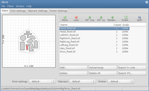

Při návrhu a tisku objektů využíváme několik aplikací. Tady najdete jejich seznam.

### OpenSCAD
 Pro 3D modelovaní existuje nespočet programů. Ve většině z nich ale uživatel modeluje v režimu WYSIWYG, tedy myší manipuluje s objekty přímo v projekci. V OpenSCADu ale modely programujete: vytváříte základní tvary a ty k sobě např. přičítáte nebo od sebe odečítáte. Říká se tomu [CSG modeling](http://en.wikipedia.org/wiki/Constructive_solid_geometry). Pokud budete vyrábět film nebo hru, asi budete chtít pracovat spíše s vizuální stránkou věci; oproti tomu, pokud budete modelovat součástku do stroje, bude vás spíš zajímat absolutní kontrola nad tvarem objektu. V tom případě by vás mohl OpenSCAD zaujmout. My jej používáme například k návrhům součástek na nové tiskárny.

Výuka programování součástek v OpenSCADu je součástí [předmětu 3D tisk na FIT ČVUT](vyuka).

{{ site.icons.web }} [Český článek na LinuxEXPRES.cz](http://www.linuxexpres.cz/software/openscad-programujte-3d-modely-wysiwym)

{{ site.icons.web }} [Domovská stránka OpenSCADu](http://www.openscad.org/)
{{ site.icons.web }} [Rozsáhlý manuál](http://en.wikibooks.org/wiki/OpenSCAD_User_Manual)

{{ site.icons.fedora }} `sudo yum install openscad openscad-MCAD`
{{ site.icons.ubuntu }} `sudo apt-get install openscad`

### MeshLab
 MeshLab je aplikace pro vytváření a editaci 3D modelů. MeshLab vznikl na Fakultě informatiky Univerzity v Pise, vytvořili jej z převážné části sami studenti. Umožňuje importovat a exportovat různé formáty pro reprezentaci 3D dat. Kromě hlavní části aplikace umožňuje především jednoduše prohlížet 3D objekty ve formátu STL a zjednodušovat je.

{{ site.icons.web }} [Domovská stránka MeshLabu](http://meshlab.sourceforge.net/)

{{ site.icons.web }} [MeshLab Blog](http://meshlabstuff.blogspot.com/)

{{ site.icons.web }} [MeshLabu Wiki](https://sourceforge.net/apps/mediawiki/meshlab)

{{ site.icons.fedora }} `sudo yum install meshlab`
{{ site.icons.ubuntu }} `sudo apt-get install meshlab`

### Skeinforge a SFACT
Skeinforge slouží ke slicování objektů, tedy k nařezání na jednotlivé tiskové vrstvy a k vypočítání průběhu tiskové hlavy. Přestože jeho uživatelské rozhraní není zrovna přívětivé a slicování trvá velice dlouho, dosahuje velice kvalitních výsledků. Pokud použijete ke slicování místo CPythonu PyPy, slicování je čtyřikrát rychlejší. Slicování pomocí Skeinforge můžete vyvolat přímo z některých ovládacích programů k tiskárně. Existuje také fork Skeinforge nazvaný SFACT, který vylepšuje řadu věcí.

{{ site.icons.web }} [Stažení Skeinforge](http://fabmetheus.crsndoo.com/)
{{ site.icons.web }} [Stažení SFACTu](http://www.reprapfordummies.net/)

{{ site.icons.web }} [Manuál ke Skeinforge](http://fabmetheus.crsndoo.com/wiki/index.php/Skeinforge)
{{ site.icons.web }} [Naše profily pro Skeinforge](https://github.com/3DprintFIT/3dprintfit.github.com)

{{ site.icons.fedora }} `sudo yum install skeinforge`
{{ site.icons.fedora }} `sudo yum install sfact`

{{ site.icons.ubuntu }} `sudo apt-get install sfact`

### Slic3r
 Slic3r je jinou aplikací pro slicování. Kromě velice přehledného uživatelského rozhraní nabízí rozdělení profilů na tři &ndash; pro různé tiskárny, pro různé materiály a pro různé účely. Tam kde si vystačíte s `n` profily, ve Skeinforge byste jich potřebovali `(n/3)^3` na pokrytí všech kombinací. Slic3r dále umožňuje velmi pohodlnou přípravu tiskového plátu a využívá k výpočtu více vláken. V některých případech ale nedává tak dobré výsledky, ačkoli jeho vývoj jde oproti stagnujícímu Skeinforge rychle kupředu.

{{ site.icons.web }} [Domovská stránka Slic3ru](http://slic3r.org/)
{{ site.icons.web }} [Třídílný článek popisující jednotlivé volby](http://richrap.blogspot.cz/2012/01/slic3r-is-nicer-part-1-settings-and.html)

{{ site.icons.fedora }} `sudo yum install slic3r`

### Printrun
Printrun je sada aplikací na práci s tiskárnou. **Plater** je velmi primitivní aplikace na přípravu tiskového plátu. Důležitější jsou ale aplikace **Pronsole** a **Pronterface** k ovládání tiskárny. První znich je, jak plyne z názvu, konzolová, ta druhá je grafická. Pronterafce umí ovládat tiskárnu, vizualizovat jednotlivé vrstvy tisku a integruje libovolný slicovací program (jako výchozí je nastaven Skeinforge). Momentálně používáme právě Pronterface, protože je to nejednoduší ovládací program.

{{ site.icons.web }} [Printrun na RepRapWiki](http://reprap.org/wiki/Printrun)

{{ site.icons.fedora }} `sudo yum install printrun` pro celý balík

{{ site.icons.fedora }} `sudo yum install plater/pronsole/pronterface` pro jednotlivé aplikace

{{ site.icons.ubuntu }} `sudo apt-add-repository ppa:richi-paraeasy/ppa && sudo apt-get update`

{{ site.icons.ubuntu }} `sudo apt-get install pronsole/pronterface`

### RepetierHost
 RepetierHost je aplikace, která nabízí kompletní workflow k tisku. Věc, kterou chcete vytisknout, nahrajete do aplikace, umístíte ji na 3D tiskovou plochu a necháte nařezat pomocí Slic3ru nebo Skeinforge přímo z aplikace. Výsledné instrukce pro tiskárnu (G-Code) můžete měnit přímo v aplikaci a prohlížet průběh tiskové hlavy ve 3D zobrazení. RepetierHost nabízí i českou lokalizaci.

{{ site.icons.web }} [Web RepetierHostu](http://www.repetier.com/documentation/repetier-host/)
{{ site.icons.fedora }} `sudo yum install RepetierHost`

### Cura
 Cura je další aplikací na ovládání tiskárny. Původně vnikla jako fork Skeinforge, ale oproti slicovaní nyní nabízí i možnost ovládat tiskárnu. Specializuje se na modely Ultimaker, do kterých umí i nahrávat vylepšený firmware, ale dá se s ní tisknout i na tiskárnách RepRap. Přestože jádrem slicování je Skeinforge, aplikace nemá jeho ošklivé rozhraní, ale své vlastní. Zachovává při tom ale minimálně stejnou kvalitu výsledku.

{{ site.icons.web }} [Web Cury](http://daid.github.com/Cura/)
{{ site.icons.fedora }} `sudo yum install cura`

### KISSlicer
 KISSlicer znamená Keep It Simple Slicer &ndash; je tedy dalším slicovacím programem, jako jediný v tomto seznamu není open-source a nabízí i placenou variantu. Nemáme s ním mnoho zkušeností a uvádíme ho zde spíš pro pořádek.

{{ site.icons.web }} [Web KISSliceru](http://www.kisslicer.com/)
