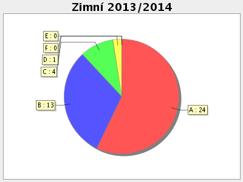
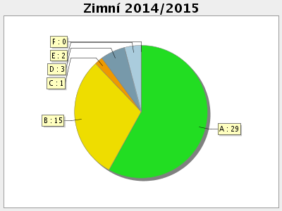

Na FIT ČVUT vyučujeme od zimního semestru v akademickém roce 2013/2014 volitelný bakalářský předmět 3D tisk (BI-3DT, BI-3DT.1 a BIE-3DT.1). V tomto letním semestru běží předmět již potřetí, navíc s jednou paralelkou v angličtině.

**Anotace:** Studenti se naučí navrhnout trojrozměrné objekty optimalizované pro tisk na tiskárně RepRap a realizovat samotný tisk. Budou umět objekty navrhnout, připravit pro tisk a vytisknout v plném rozsahu.

Jedná se o předmět ukončený klasifikovaným zápočtem, ohodnocený 4 kredity (pozn.: v prvním běhu to byly pouze 3). V rámci horizontální propustnosti si předmět mohou zapsat i studenti ostatních fakult ČVUT.

Veřejně dostupné materiály k předmětu najdete na [Eduxu](https://edux.fit.cvut.cz/courses/BI-3DT/).

### Hodnocení

 Celkové hodnocení se skládá z bodů získaných v průběhu semestru. Nekoná se žádná zkouška, ani se nepíše žádný test. Body lze získat za:

 * Úlohy na cvičeních
 * Domácí úkol v [OpenSCADu](aplikace)
 * Semestrální práci (50 % hodnocení)

V rámci semestrální práce studenti vytvoří počítačový model, připraví ho k tisku a sami vytisknou na tiskárnách, které v semestru postavili. Výsledky si můžete prohlédnout v [galerii](galerie).

### Cvičení

 * Principy předmětu, Technologie tisku a RepRap
 * OpenSCAD
 * Práce s 3D modely ve formě meshí
 * Slicing, GCode, Slic3r, KISSlicer
 * Programová manipulace s STL
 * Stavba tiskárny
 * Tisk - základy, mosty, podpory, pokročilé technicky

### Výsledky studentů

