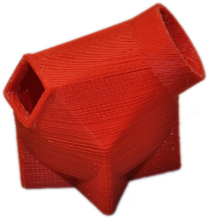

Na FIT ČVUT vyučujeme od zimního semestru v akademickém roce 2013/2014 volitelný bakalářský předmět 3D tisk. V prvním běhu předmětu otevíráme dvě paralelky každou pro 24 studentů.

**Anotace:** Studenti se naučí navrhnout trojrozměrné objekty optimalizované pro tisk na tiskárně RepRap a realizovat samotný tisk. Budou umět objekty navrhnout, připravit pro tisk a vytisknout v plném rozsahu.

Jedná se o předmět ukončený klasifikovaným zápočtem, v prvním běhu za 3 kredity (příště pravděpodobně 4). V rámci horizontální propustnosti si předmět mohou zapsat i studenti ostatních fakult ČVUT. Uvažujeme o otevření předmětu i v anglickém jazyce (nejdříve však v letním semestru 2014/2015).

### Hodnocení

 Celkové hodnocení se skládá z bodů získaných v průběhu semestru. Nekoná se žádná zkouška, ani se nepíše žádný test. Body lze získat za:

 * Účast na cvičeních, kde se staví tiskárny
 * Slicovací úlohy na cvičeních
 * Domácí úkol v [OpenSCADu](aplikace)
 * Semestrální práci (60 % hodnocení)
 * Další aktivitu nad rámec povinností

V rámci semestrální práce studenti vytvoří počítačový model, připraví ho k tisku a sami vytisknou na tiskárnách, které v semestru postavili. Výsledky si můžete prohlédnout v [galerii](galerie).

### Cvičení

 * Principy předmětu, Technologie tisku a RepRap, OpenSCAD
 * OpenSCAD – pokročilé techniky
 * Práce s 3D modely ve formě meshí
 * Slicing, GCode, Slic3r
 * Skeinforge
 * Stavba tiskárny, Tisk
